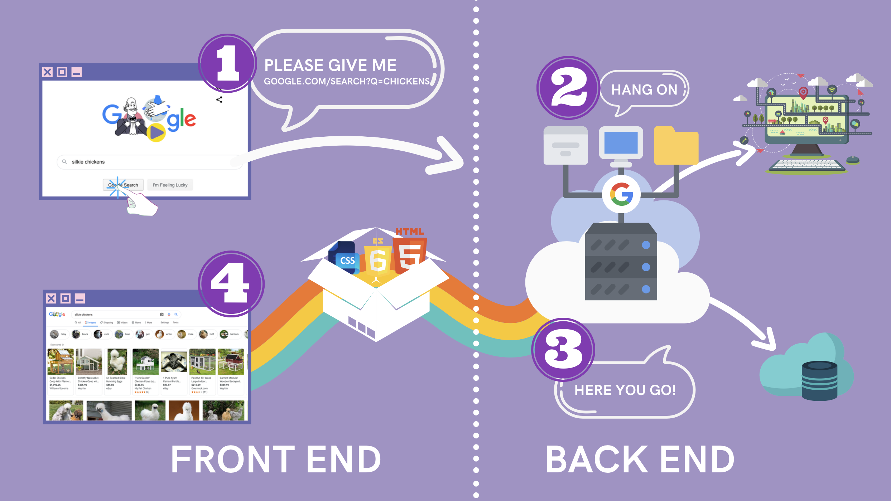

# The Web Developer Bootcamp :computer:

This repository contains the exercises from "[The Web Developer Bootcamp 2024](https://www.udemy.com/course/the-web-developer-bootcamp/?couponCode=KEEPLEARNING)" course on Udemy.

The **Web Developer Bootcamp** is a course on Udemy that covers various topics related to web development. It is designed to provide a comprehensive understanding of web development technologies and techniques. The course covers HTML, CSS, JavaScript, Node.js, Express.js, MongoDB, and more. It includes hands-on exercises and projects to help you apply what you learn. :rocket:

  

## Content

1. HTML.
   1. The essentials.
